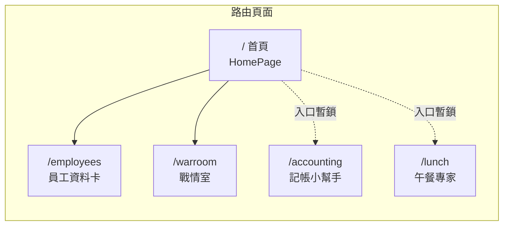
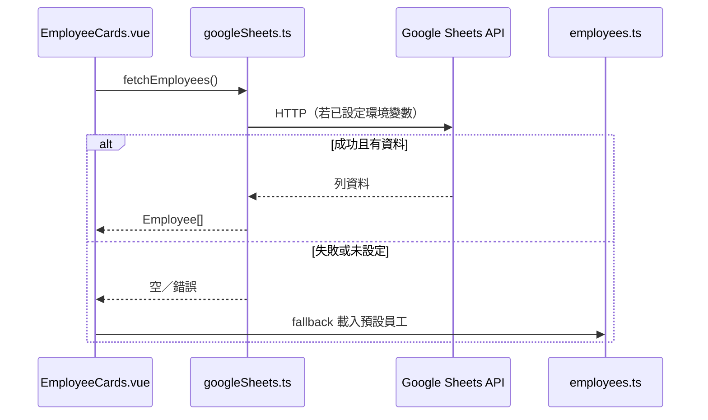

<p align="center">
  
</p>

<p align="center">
  <a href="https://vuejs.org/"></a>
  <a href="https://vitejs.dev/"></a>
  <a href="https://tailwindcss.com/"></a>
  
</p>

<p align="center">
  <strong>線上預覽 →</strong>
  <a href="https://lockingwang.github.io/employee-cards/">https://lockingwang.github.io/employee-cards/</a>
</p>

---

## 這是什麼專案？

以 **Vue 3 + Vite** 建置的**純前端靜態 SPA**，對外名稱為多功能「工具集」：**首頁為功能入口**，核心亮點為 **員工資料卡**（翻轉卡片、動畫、Google 試算表資料），並含 **戰情室**（伺服器監控）、以及 **記帳／午餐**等頁面原型（首頁入口標示「即將推出」並暫時鎖定）。



---

## 畫面與功能導覽

### 視覺示意（功能模組）

<p align="center">
  
</p>

### 主要模組說明

| 路由 | 說明 | 亮點 |
|------|------|------|
| `/` | **首頁**：2×2 功能網格、GSAP 進場動畫、版本資訊 | Lucide 圖示、漸層與裝飾元素 |
| `/employees` | **員工資料卡**：8 張可翻轉卡片、彈幕 | GSAP、`EmployeeCard`、可選 **Google Sheets** |
| `/warroom` | **戰情室**：監控面板、自動輪詢、音效提示 | 儀表統計；錯誤 LOG 可寫回試算表（見 `API_LOG_SETUP.md`） |
| `/accounting` | **記帳小幫手**：收支 UI 原型 | 首頁點擊會提示「即將推出」，仍可直接輸入網址進入頁面 |
| `/lunch` | **午餐專家**：隨機推薦午餐 | 同上，首頁入口暫鎖 |

### 資料流（員工資料卡）



---

## 技術棧

| 類別 | 選用 |
|------|------|
| 框架 | Vue 3（Composition API，script setup） |
| 路由 | vue-router |
| 建置 | Vite（`rolldown-vite`） |
| 樣式 | Tailwind CSS 4、PostCSS |
| 動畫 | GSAP（含 ScrollTrigger 等） |
| 圖示 | Lucide Vue Next、PrimeIcons |
| UI | PrimeVue（部分頁面） |
| 字型 | Google Fonts（Nunito、Poppins） |
| 資料 | 本地 `src/data/employees.ts`；可選 Google Sheets |

---

## 專案結構（精簡）

```
src/
├── components/
│   └── EmployeeCard.vue      # 員工翻轉卡片
├── pages/
│   ├── HomePage.vue          # 首頁入口
│   ├── EmployeeCards.vue     # 員工卡列表 + Sheets 載入
│   ├── WarRoom.vue           # 戰情室
│   ├── AccountingHelper.vue  # 記帳原型
│   └── LunchExpert.vue       # 午餐推薦原型
├── services/
│   └── googleSheets.ts       # Sheets API、彈幕、API LOG 寫入
├── data/
│   └── employees.ts          # 預設員工與型別
├── config/
│   └── version.ts            # 版本與功能列表
├── router/
│   └── index.ts
├── App.vue
├── main.js
└── style.css
```

延伸說明：`GOOGLE_SHEETS_SETUP.md`、`API_LOG_SETUP.md`。

---

## 本機開發

**需求：** Node.js 18+（建議 20）、npm。

```bash
npm install
npm run dev         # 開發伺服器，預設 http://localhost:5173
npm run build       # 產出 dist/
npm run preview     # 預覽正式建置
```

**生產環境 base path：** `vite.config.js` 於 production 使用 `/employee-cards/`，對應 GitHub Pages 子路徑。

---

## 部署與環境變數

| 情境 | 做法 |
|------|------|
| **本機** | 複製 `.env.example` 為 `.env`，填入 `VITE_GOOGLE_SHEETS_*`（勿提交 `.env`） |
| **GitHub Pages（Actions 建置）** | 在 Repo → **Settings** → **Secrets and variables** → **Actions** 新增同名 Secrets，workflow 建置時會注入變數 |
| **其他主機** | 在建置環境設定相同的 `VITE_*` 變數 |

`.gitignore` 已排除 `.env`。若曾在程式碼中暴露 API Key，請至 [Google Cloud Console](https://console.cloud.google.com/apis/credentials) 輪替金鑰並限制用途。

---

## English summary

**Employee Cards** is a Vue 3 + Vite static SPA deployed to GitHub Pages. It includes a **home hub**, **flip employee cards** (GSAP, optional Google Sheets + local fallback), and a **War Room** dashboard for server checks (with optional Sheets logging). Accounting and Lunch routes exist as prototypes; entry from the home grid is temporarily blocked with a “coming soon” alert while direct URLs still work.

**Live demo:** [https://lockingwang.github.io/employee-cards/](https://lockingwang.github.io/employee-cards/)

---

## License

MIT License.
